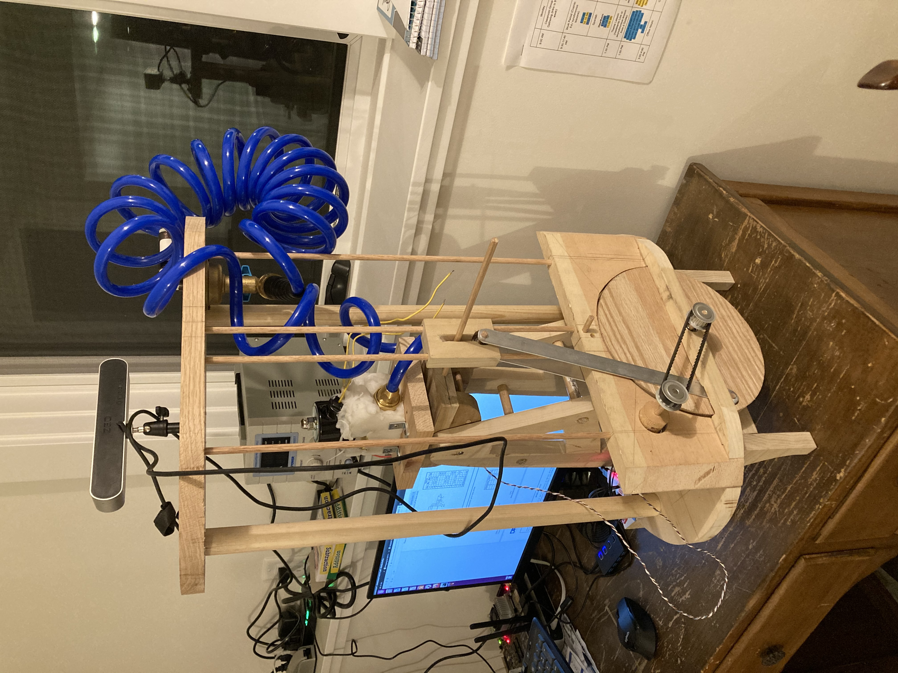
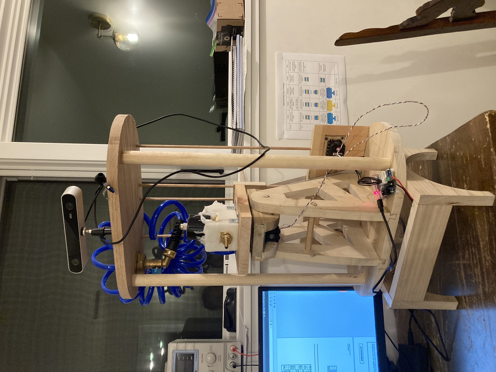

# scarecrow
Nvidia Jetson TX1 based garden guarding robot

This is the source code for a water cannon equipped scarecrow robot to keep birds and animals out of my garden.

The robot is based on an Nvidia Jetson TX1 computer running a TensorFlow engine for detection using the Deepstream framework.

